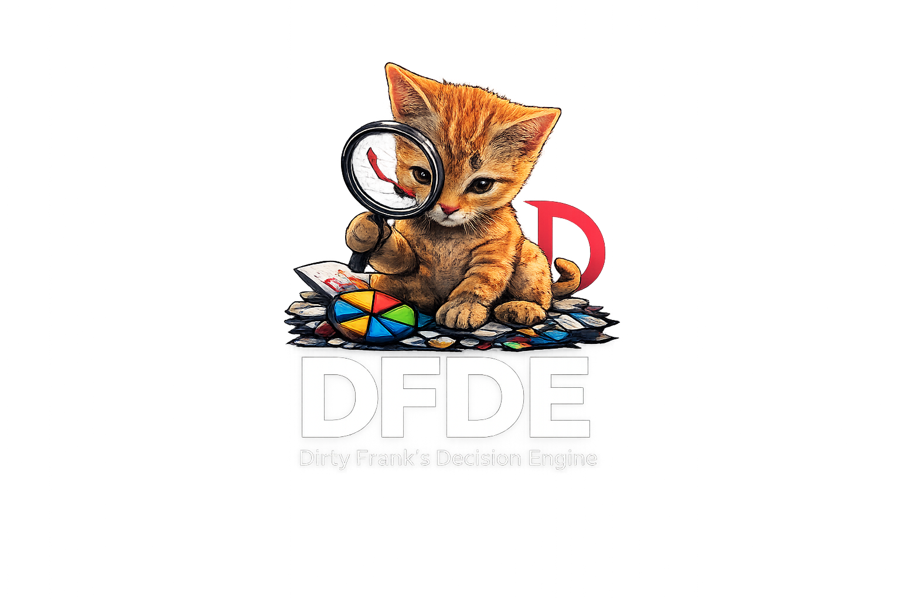
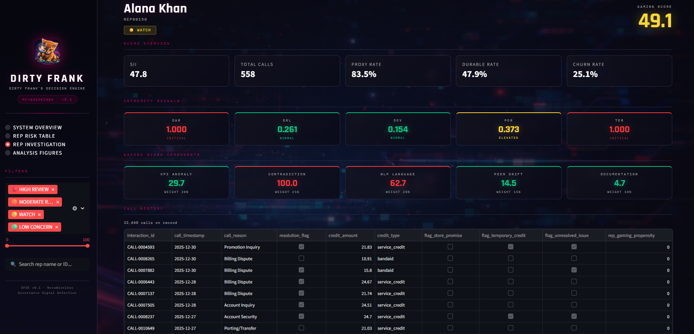
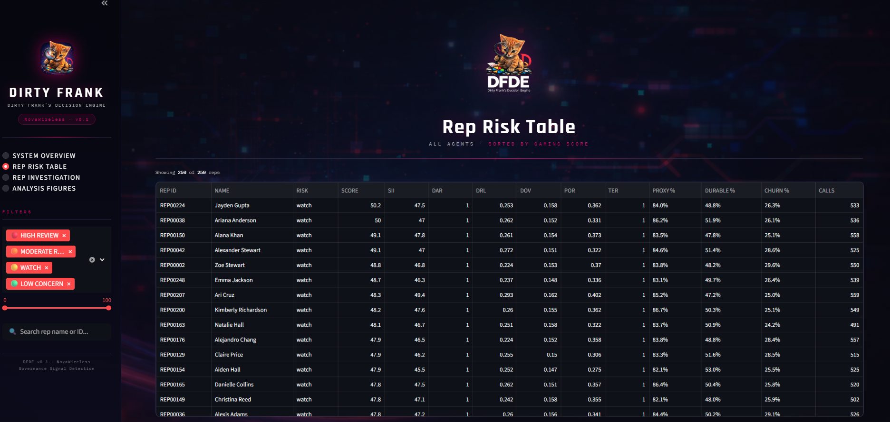
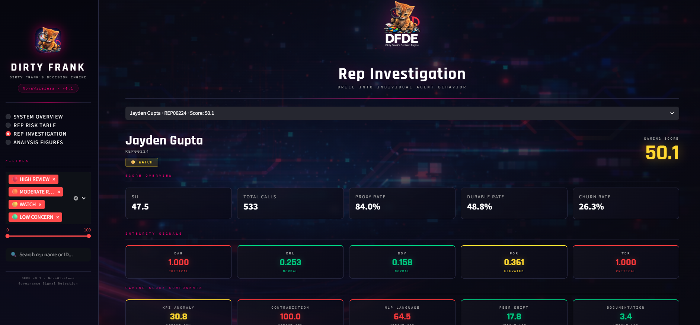
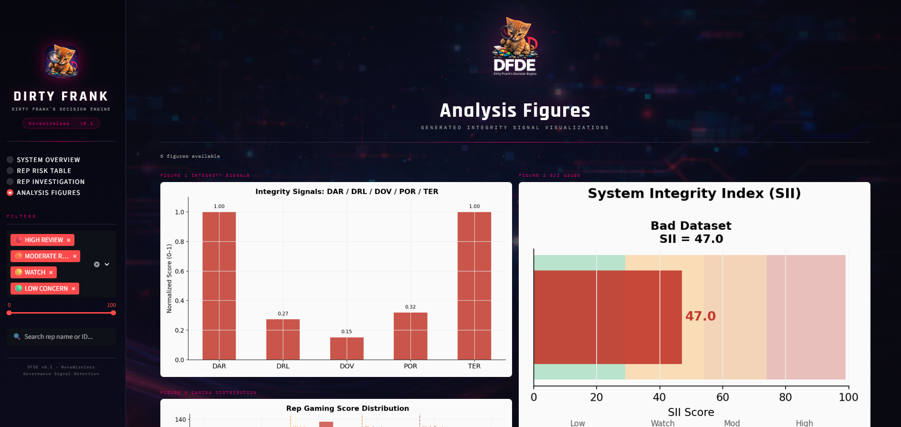
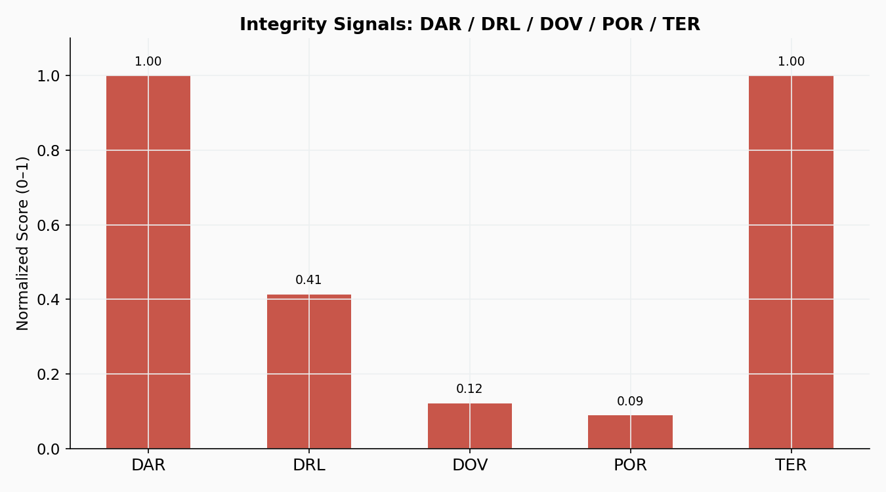
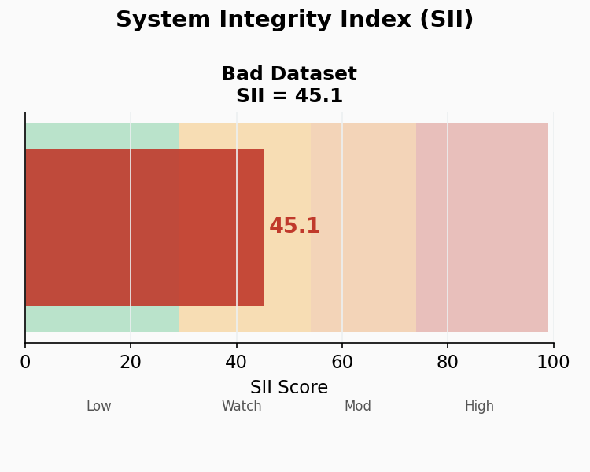
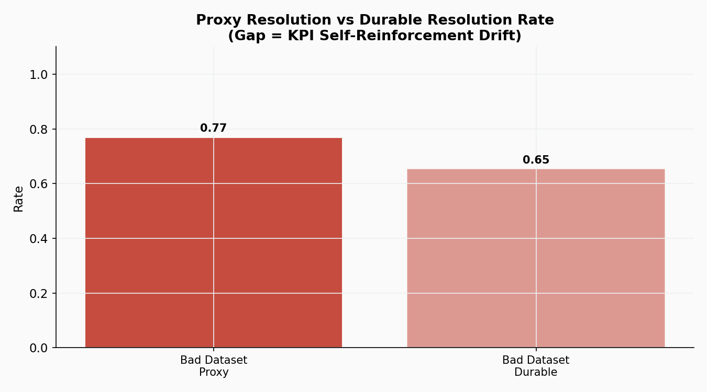

# Dirty Frank's Decision Engine
### Legacy Dataset — Gaming Period Analysis

**A governance and root-cause detection system for call center permission management**

---

*"Optimization without integrity is acceleration without direction."*
— Aulabaugh (2026), When KPIs Lie

---

## What Is This Repository

This repository contains the **dashboard screenshots, analysis figures, and documentation assets** from the DFDE Legacy dataset analysis — a controlled study of call center operations during a known period of metric gaming behavior.

This is a **product showcase**, not a code repository. Implementation details are not included.

---

## What DFDE Does

DFDE is an operational governance system that answers three questions leadership currently cannot answer without a dedicated detection framework:

| Question | Why It Matters |
|---|---|
| **Who specifically is generating the signal?** | Enables targeted permission review instead of department-wide restriction |
| **Is the behavior isolated or systemic?** | Determines whether the response is disciplinary or architectural |
| **Where did the problem originate?** | Distinguishes downstream call center behavior from upstream retail misrepresentation |

The system is not designed to accuse individuals automatically. It is designed to surface evidence so leadership can act precisely.

---

## The Problem This Solves

When a KPI simultaneously determines compensation, drives ranking systems, labels training data, and triggers automated recommendations — it becomes structurally unstable.

The standard governance response to permission abuse is department-wide restriction. Every agent loses access. Legitimate use cases disappear alongside abusive ones. Agent effectiveness drops. Customer experience degrades.

**DFDE replaces the blunt instrument with a precise one.**

---

## Legacy Dataset: Key Findings

This repository documents findings from a dataset constructed during a period of known gaming behavior across 250 agents and 133,517 calls.

| Signal | Value | Status |
|---|---|---|
| System Integrity Index (SII) | **47.1** | 🟡 WATCH |
| Proxy Resolution Rate | **84.1%** | Dashboard figure |
| Durable Resolution Rate | **51.3%** | Actual 60-day outcome |
| **Drift Gap** | **32.8pp** | The measurement lie |
| Delayed Adverse Rate (DAR) | **1.000** | 🔴 CRITICAL |
| Terminal Exit Rate (TER) | **1.000** | 🔴 CRITICAL |
| Proxy Overfit Ratio (POR) | **0.321** | 🟡 ELEVATED |

The **32.8 percentage point gap** between what the KPI dashboard reports and what customers actually experience is the core finding. The system is reporting success on a metric that has become structurally disconnected from the outcome it was designed to represent.

---

## Dashboard Screenshots

### System Overview

*SII = 47.1 (WATCH). 250 reps analyzed. 133,517 calls. Drift gap 32.8pp.*

---

### Rep Risk Table

*All 250 agents cluster in the Watch band — no outliers. This is the signature of systemic gaming, not individual misconduct.*

---

### Rep Investigation

*Individual agent drill-down showing integrity signals, gaming score components, and full call history.*

---

### Analysis Figures

*Six integrity signal visualizations generated from the legacy dataset.*

---

## Analysis Figures

### Figure 1 — Integrity Signals

*DAR and TER at ceiling (1.0). POR elevated at 0.32 — proxy accelerating away from durable outcomes.*

---

### Figure 2 — System Integrity Index Gauge

*SII = 47.1 in the Watch band. Structural drift is active and measurable.*

---

### Figure 6 — The Headline Finding

*Proxy resolution 0.84 vs. durable resolution 0.51. The 33-point gap is the measurement lie.*

---

## The Score Distribution Finding

When every agent in a department scores at approximately the same level rather than producing a distribution with clear outliers, **the problem is not individual — it is architectural**.

The gaming pattern is embedded in the measurement system, not localized to specific bad actors. This is the scenario in which blanket permission removal is most harmful and least effective.

---

## Formal Integrity Signals

DFDE implements the Trust Signal Health framework from Aulabaugh (2026):

| Signal | Definition | Window |
|---|---|---|
| **DAR** — Delayed Adverse Rate | Repeat contacts following labeled-resolved calls | 31–60 days |
| **DRL** — Downstream Remediation Load | Distributional drift in post-success workload | Rolling |
| **DOV** — Durable Outcome Validation | Decay in proxy label predictive validity | 60-day outcomes |
| **POR** — Proxy Overfit Ratio | Rate at which proxy improves faster than durable outcomes | Rolling |
| **TER** — Terminal Exit Rate | Whether resolutions retain customers or delay churn | 30 days |
| **SII** — System Integrity Index | Weighted composite governance constraint (0–100) | Rolling |

---

## Related Research

This dataset supports the following working papers from the NovaWireless KPI Drift Observatory:

- **When KPIs Lie: Governance Signals for AI-Optimized Call Centers** — Aulabaugh (2026)
- **When KPIs Lie: Addendum B — Cross-Channel Retail Audit** — Aulabaugh (2026)
- **Optimization Pressure and Metric Integrity** — Aulabaugh (2026)
- **Hardening the System Integrity Index** — Aulabaugh (2026)
- **The Corrupted Label Problem in Telecom Churn Prediction** — Aulabaugh (2026)

---

## Status

> **ROUGH DRAFT — NOT COMPLETE**
>
> This is a working prototype developed on March 15, 2026 in the seven hours following the NovaWireless Loyalty Promotions and Permission Handling strategic review. Calibration assumptions are documented and pending formal validation. A clean baseline dataset comparison is in progress.

---

## About

**Author:** Gina Aulabaugh
**Organization:** PixelKraze, LLC
**Role:** T-Mobile Loyalty Care Representative
**Date:** March 15, 2026

Developed independently as a contribution to operational governance research. Correspondence: PixelKraze, LLC.

---

---

## Data Sources

The synthetic datasets used in this research were derived from and substantially
transformed from publicly available sources including IBM Developer (Telco Customer
Churn), Kaggle, FCC.gov, and data.gov. Raw source data is not reproduced in this
repository. All derived datasets encode original theoretical constructs and are the
work of the author.

---

Dirty Frank's Decision Engine v0.1 · PixelKraze, LLC · 2026

